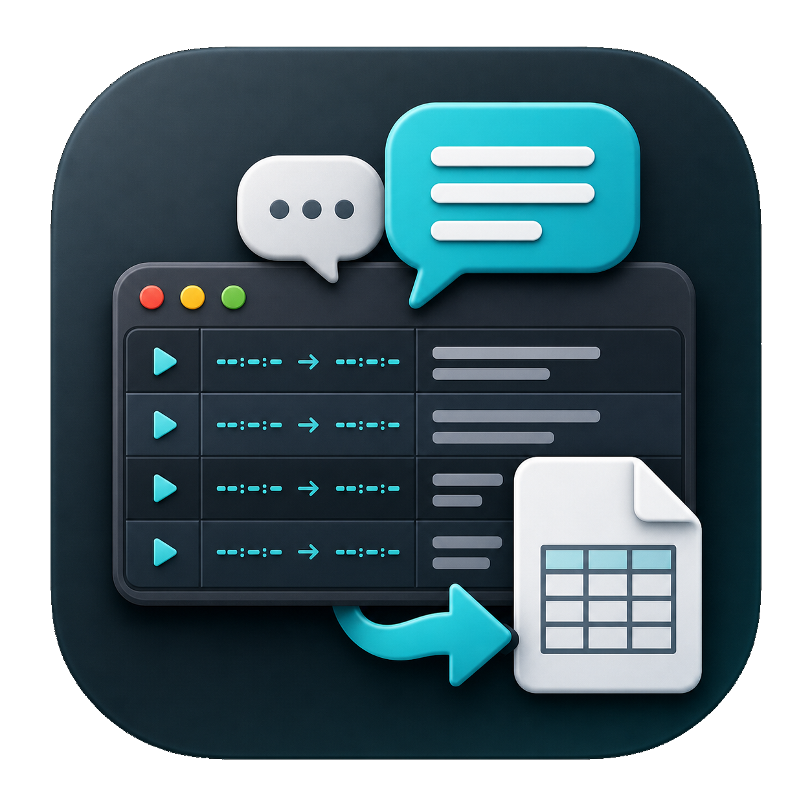

<p align="center">
  
</p>

<h1 align="center">AVT_helper</h1>

<p align="center">
  <strong>Language:</strong> EN | <a href="README.ru.md">RU</a>
</p>

<p align="center">
  <strong>macOS subtitle conversion and DOCX role tables</strong>
</p>

<p align="center">
  <a href="https://github.com/boundlessend/AVT_helper/actions/workflows/ci.yml"></a>
  <a href="https://github.com/boundlessend/AVT_helper/releases"></a>
  
  
  
</p>

`AVT_helper` is a native macOS app for subtitle conversion and DOCX dialogue tables.

It imports `ASS`, `SSA`, `SRT`, `VTT`, and `SRP`, exports `ASS`, `SRT`, `VTT`, and `DOCX`, and can create role-assignment DOCX files with Word highlight colors.

The window shows the imported file as a dubbing sheet: timecode, role, line. Every role is highlighted with a marker color, and after a role assignment the sheet switches to the colors of the assigned voices, so the screen matches the DOCX.

Input encoding (UTF-8, UTF-16, Windows-1251) is detected automatically. Import and export run in the background with a progress bar and can be cancelled, so the window stays responsive on large files.

## Install

1. Download `AVT_helper.dmg` from the latest release.
2. Open `AVT_helper.dmg`.
3. Drag `AVT_helper.app` to `Applications`.
4. Open `AVT_helper.app` from `Applications`.

If macOS blocks the first launch, run:

```bash
sudo xattr -rd com.apple.quarantine "/Applications/AVT_helper.app"
```

Then open the app again.

## Usage

> On first launch the interface follows the system language. Switch it in `Settings` (`Cmd+,`) -> `App language`.

1. Click `Open subtitles` (`Cmd+O`), drop a subtitle file onto the sheet in the middle of the window, or open the file from Finder. The last eight files are under `File` -> `Open Recent`.
2. Choose the output folder in the left rail. It is remembered between launches.
3. Select one or more export formats: `ASS`, `SRT`, `VTT`, or `DOCX`.
4. Check the roles you need in the role list on the right if you export separate SRT files per role.
5. Click `Start` (`Cmd+Return`). A long run can be stopped with `Cancel`.
6. To create a role-assignment DOCX, load a file with roles and click `Make role assignment`.

Existing files are never overwritten: a numbered suffix is added to the new file instead.

## DOCX Output

DOCX files include the file name, detected roles, a timing/role/dialogue table, and role statistics. Role-assignment DOCX files also list assigned voices above the table and highlight assigned roles with the selected Word highlight colors.

## License

BSD 3-Clause. See [LICENSE](LICENSE).
